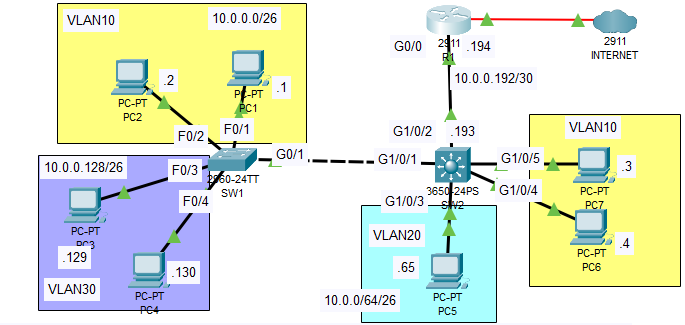

# Day 18 Lab - Multilayer Switching

## 1. Replace Router on a Stick (ROAS) with Point-to-Point Layer 3 Connection



### Check interfaces on router and delete sub-interfaces

1. I will first enter Privileged Exec Mode
2. Check interfaces in router

```jsx
R1> enable
R1# show ip interface brief
Interface              IP-Address      OK? Method Status                Protocol 
GigabitEthernet0/0     unassigned      YES NVRAM  up                    up 
GigabitEthernet0/0.10  10.0.0.62       YES manual up                    up 
GigabitEthernet0/0.20  10.0.0.126      YES manual up                    up 
GigabitEthernet0/0.30  10.0.0.190      YES manual up                    up 
GigabitEthernet0/1     unassigned      YES NVRAM  administratively down down 
GigabitEthernet0/2     unassigned      YES NVRAM  administratively down down 
GigabitEthernet0/0/0   1.1.1.2         YES manual up                    up 
Vlan1                  unassigned      YES unset  administratively down down
```

1. As we see, there are subinterfaces from last lab
2. Enter global configuration mode and reverse subinterfaces

```jsx
R1#conf t
Enter configuration commands, one per line.  End with CNTL/Z.
R1(config)#no interface g0/0.10
R1(config)#
%LINK-3-UPDOWN: Interface GigabitEthernet0/0.10, changed state to down

%LINEPROTO-5-UPDOWN: Line protocol on Interface GigabitEthernet0/0.10, changed state to down

R1(config)#no interface g0/0.20
R1(config)#
%LINK-3-UPDOWN: Interface GigabitEthernet0/0.20, changed state to down

%LINEPROTO-5-UPDOWN: Line protocol on Interface GigabitEthernet0/0.20, changed state to down

R1(config)#no interface g0/0.30
R1(config)#
%LINK-3-UPDOWN: Interface GigabitEthernet0/0.30, changed state to down

%LINEPROTO-5-UPDOWN: Line protocol on Interface GigabitEthernet0/0.30, changed state to down
```

1. Set interfaces back to default state 

```jsx
R1(config)#default interface g0/0
Building configuration...

Interface GigabitEthernet0/0 set to default configuration
```

1. Then configure g0/0 interface IP address 
    1. enter g0/0 interface
    2. set IP address to follow the network diagram
        1. IP address: 10.0.0.194
        2. Netmask: /30 = 255.255.255.252
    3. Make sure it’s not set as shutdown

```jsx
R1(config)#int g0/0
R1(config-if)#ip add 10.0.0.194 255.255.255.252
R1(config-if)#no shut
```

1. Double check the interface g0/0 is up/up 

```jsx
R1(config)#do sh ip in br
Interface              IP-Address      OK? Method Status                Protocol 
GigabitEthernet0/0     10.0.0.194      YES manual up                    up 
GigabitEthernet0/1     unassigned      YES NVRAM  administratively down down 
GigabitEthernet0/2     unassigned      YES NVRAM  administratively down down 
GigabitEthernet0/0/0   1.1.1.2         YES manual up                    up 
Vlan1                  unassigned      YES unset  administratively down down
```

1. Save configuration
    1. use ‘do’ to save on global config mode 
    
    ```jsx
    R1(config)#do write
    Building configuration...
    [OK]
    ```
    

### Enter SW2 and enable multilayer switching

1. On the interface connected to the router set the interface to default settings 
    1. enter global configuration mode 
    2. Set g1/0/2 to default since it’s still set to fot1q for subinterfaces

```jsx
SW2(config)#default inter
SW2(config)#default interface g1/0/2
Building configuration...

Interface GigabitEthernet1/0/2 set to default configuration
```

1. Right now, we can’t see routing or set an IP address on the switch, so we enable layer 3 routing and configure the switch as a routed port 

```jsx
SW2(config)#ip routing
SW2(config)#int g1/0/2
SW2(config-if)#no switchport
SW2(config-if)#
%LINEPROTO-5-UPDOWN: Line protocol on Interface GigabitEthernet1/0/2, changed state to down

%LINEPROTO-5-UPDOWN: Line protocol on Interface GigabitEthernet1/0/2, changed state to up
```

1. We can now assign an address to the Multilayer switch 
    1. IP address: 10.0.0.193
    2. Netmask: /30 = 255.255.255.252

```jsx
SW2(config-if)#ip add 10.0.0.193 255.255.255.252
SW2(config-if)#no shut
SW2(config-if)#exit
```

1. Outside of the interface, set the default route to R1 

```jsx
SW2(config)#ip route 0.0.0.0 0.0.0.0 10.0.0.194
SW2(config)#end
SW2#
%SYS-5-CONFIG_I: Configured from console by console

SW2#sh ip int br
Interface              IP-Address      OK? Method Status                Protocol 
GigabitEthernet1/0/1   unassigned      YES unset  up                    up 
GigabitEthernet1/0/2   10.0.0.193      YES manual up                    up 
GigabitEthernet1/0/3   unassigned      YES unset  up                    up 
GigabitEthernet1/0/4   unassigned      YES unset  up                    up 
GigabitEthernet1/0/5   unassigned      YES unset  up                    up 
SW2#sh ip rout
Codes: C - connected, S - static, I - IGRP, R - RIP, M - mobile, B - BGP
       D - EIGRP, EX - EIGRP external, O - OSPF, IA - OSPF inter area
       N1 - OSPF NSSA external type 1, N2 - OSPF NSSA external type 2
       E1 - OSPF external type 1, E2 - OSPF external type 2, E - EGP
       i - IS-IS, L1 - IS-IS level-1, L2 - IS-IS level-2, ia - IS-IS inter area
       * - candidate default, U - per-user static route, o - ODR
       P - periodic downloaded static route

Gateway of last resort is 10.0.0.194 to network 0.0.0.0

     10.0.0.0/8 is variably subnetted, 2 subnets, 2 masks
C       10.0.0.192/30 is directly connected, GigabitEthernet1/0/2
L       10.0.0.193/32 is directly connected, GigabitEthernet1/0/2
S*   0.0.0.0/0 [1/0] via 10.0.0.194
```

## 2. Configure Switch Virtual Interfaces (SVI) on SW2

1. On SW2, enter global configuration mode and enable vlan10, 20, 30 with last usable ip address in its network 
2. VLAN10
    1. IP address vlan10: 10.0.0.62
    2. Netmask: /26 = 255.255.255.192

```jsx
SW2#conf t
Enter configuration commands, one per line.  End with CNTL/Z.
SW2(config)#interface vlan10
SW2(config-if)#
%LINK-5-CHANGED: Interface Vlan10, changed state to up

%LINEPROTO-5-UPDOWN: Line protocol on Interface Vlan10, changed state to up

SW2(config-if)#ip add 10.0.0.62 255.255.255.192
SW2(config-if)#no shut
```

1. VLAN20
    1. IP address vlan10: 10.0.0.126
    2. Netmask: /26 = 255.255.255.192

```jsx
SW2(config-if)#interface vlan20
SW2(config-if)#
%LINK-5-CHANGED: Interface Vlan20, changed state to up

%LINEPROTO-5-UPDOWN: Line protocol on Interface Vlan20, changed state to up

SW2(config-if)#ip add 10.0.0.126 255.255.255.192
SW2(config-if)#no shut
```

1. VLAN30
    1. IP address vlan10: 10.0.0.190
    2. Netmask: /26 = 255.255.255.192

```jsx
SW2(config-if)#interface vlan30
SW2(config-if)#
%LINK-5-CHANGED: Interface Vlan30, changed state to up

%LINEPROTO-5-UPDOWN: Line protocol on Interface Vlan30, changed state to up

SW2(config-if)#ip add 10.0.0.190 255.255.255.192
SW2(config-if)#no shut
```

1. Finally, check that vlan10, 20, 30 are up/up 

```jsx
SW2(config-if)#do sh ip int br
Interface              IP-Address      OK? Method Status                Protocol 
GigabitEthernet1/0/1   unassigned      YES unset  up                    up 
GigabitEthernet1/0/2   10.0.0.193      YES manual up                    up 
GigabitEthernet1/0/3   unassigned      YES unset  up                    up 
GigabitEthernet1/0/4   unassigned      YES unset  up                    up 
GigabitEthernet1/0/5   unassigned      YES unset  up                    up 
GigabitEthernet1/0/6   unassigned      YES unset  down                  down 
GigabitEthernet1/0/7   unassigned      YES unset  down                  down 
GigabitEthernet1/0/8   unassigned      YES unset  down                  down 
GigabitEthernet1/0/9   unassigned      YES unset  down                  down 
GigabitEthernet1/0/10  unassigned      YES unset  down                  down 
GigabitEthernet1/0/11  unassigned      YES unset  down                  down 
GigabitEthernet1/0/12  unassigned      YES unset  down                  down 
GigabitEthernet1/0/13  unassigned      YES unset  down                  down 
GigabitEthernet1/0/14  unassigned      YES unset  down                  down 
GigabitEthernet1/0/15  unassigned      YES unset  down                  down 
GigabitEthernet1/0/16  unassigned      YES unset  down                  down 
GigabitEthernet1/0/17  unassigned      YES unset  down                  down 
GigabitEthernet1/0/18  unassigned      YES unset  down                  down 
GigabitEthernet1/0/19  unassigned      YES unset  down                  down 
GigabitEthernet1/0/20  unassigned      YES unset  down                  down 
GigabitEthernet1/0/21  unassigned      YES unset  down                  down 
GigabitEthernet1/0/22  unassigned      YES unset  down                  down 
GigabitEthernet1/0/23  unassigned      YES unset  down                  down 
GigabitEthernet1/0/24  unassigned      YES unset  down                  down 
GigabitEthernet1/1/1   unassigned      YES unset  down                  down 
GigabitEthernet1/1/2   unassigned      YES unset  down                  down 
GigabitEthernet1/1/3   unassigned      YES unset  down                  down 
GigabitEthernet1/1/4   unassigned      YES unset  down                  down 
Vlan1                  unassigned      YES unset  administratively down down 
Vlan10                 10.0.0.62       YES manual up                    up 
Vlan20                 10.0.0.126      YES manual up                    up 
Vlan30                 10.0.0.190      YES manual up                    up
```

We can now ping from one end host to another using a multilayer switch! 🤪
