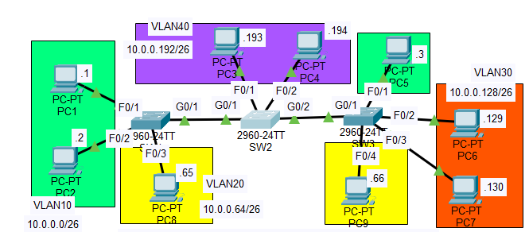

# Day 19 Lab - DTP/VTP



## Configure the switch ports as trunk ports and disable DTP

## Configuring Trunk Ports

1. View each switchport interface and determine its administrative and operational mode 

```jsx
SW1>en
SW1#sh int g0/1 sw
Name: Gig0/1
Switchport: Enabled
Administrative Mode: dynamic auto
Operational Mode: static access
Administrative Trunking Encapsulation: dot1q
Operational Trunking Encapsulation: native
Negotiation of Trunking: On
Access Mode VLAN: 1 (default)
Trunking Native Mode VLAN: 1 (default)
Voice VLAN: none
Administrative private-vlan host-association: none
Administrative private-vlan mapping: none
Administrative private-vlan trunk native VLAN: none
Administrative private-vlan trunk encapsulation: dot1q
Administrative private-vlan trunk normal VLANs: none
Administrative private-vlan trunk private VLANs: none
Operational private-vlan: none
Trunking VLANs Enabled: All
Pruning VLANs Enabled: 2-1001
Capture Mode Disabled
Capture VLANs Allowed: ALL
Protected: false
Unknown unicast blocked: disabled
Unknown multicast blocked: disabled
Appliance trust: none
```

```jsx
SW2>en
SW2#sh int g0/2 sw
Name: Gig0/2
Switchport: Enabled
Administrative Mode: dynamic auto
Operational Mode: static access
Administrative Trunking Encapsulation: dot1q
Operational Trunking Encapsulation: native
Negotiation of Trunking: On
Access Mode VLAN: 1 (default)
Trunking Native Mode VLAN: 1 (default)
Voice VLAN: none
Administrative private-vlan host-association: none
Administrative private-vlan mapping: none
Administrative private-vlan trunk native VLAN: none
Administrative private-vlan trunk encapsulation: dot1q
Administrative private-vlan trunk normal VLANs: none
Administrative private-vlan trunk private VLANs: none
Operational private-vlan: none
Trunking VLANs Enabled: All
Pruning VLANs Enabled: 2-1001
Capture Mode Disabled
Capture VLANs Allowed: ALL
Protected: false
Unknown unicast blocked: disabled
Unknown multicast blocked: disabled
Appliance trust: none

```

```jsx
SW3>en
SW3#sh interface g0/1 sw
Name: Gig0/1
Switchport: Enabled
Administrative Mode: dynamic auto
Operational Mode: static access
Administrative Trunking Encapsulation: dot1q
Operational Trunking Encapsulation: native
Negotiation of Trunking: On
Access Mode VLAN: 1 (default)
Trunking Native Mode VLAN: 1 (default)
Voice VLAN: none
Administrative private-vlan host-association: none
Administrative private-vlan mapping: none
Administrative private-vlan trunk native VLAN: none
Administrative private-vlan trunk encapsulation: dot1q
Administrative private-vlan trunk normal VLANs: none
Administrative private-vlan trunk private VLANs: none
Operational private-vlan: none
Trunking VLANs Enabled: All
Pruning VLANs Enabled: 2-1001
Capture Mode Disabled
Capture VLANs Allowed: ALL
Protected: false
```

In Administrative Mode, we can see that all of the switches are set to dynamic auto. As we learned from the Day 19 lesson in Jeremy’s IT Lab, all newer Cisco switches default to dynamic auto. Because of this, they will all be access ports. My first thought was to make SW2 interfaces g0/1 and g0/2 into trunk ports. This will automatically turn SW1 and SW3 ports into trunk ports.

1. Turn SW2 interfaces g0/2 and g0/1 into trunk ports 

```jsx
SW2#conf t
Enter configuration commands, one per line.  End with CNTL/Z.
SW2(config)#int g0/2
SW2(config-if)#sw mode trunk

SW2(config-if)#
%LINEPROTO-5-UPDOWN: Line protocol on Interface GigabitEthernet0/2, changed state to down

%LINEPROTO-5-UPDOWN: Line protocol on Interface GigabitEthernet0/2, changed state to up

SW2(config-if)#do sh int g0/2 sw
Name: Gig0/2
Switchport: Enabled
Administrative Mode: trunk
Operational Mode: trunk
Administrative Trunking Encapsulation: dot1q
Operational Trunking Encapsulation: dot1q
Negotiation of Trunking: On
Access Mode VLAN: 1 (default)
Trunking Native Mode VLAN: 1 (default)
Voice VLAN: none
Administrative private-vlan host-association: none
Administrative private-vlan mapping: none
Administrative private-vlan trunk native VLAN: none
Administrative private-vlan trunk encapsulation: dot1q
Administrative private-vlan trunk normal VLANs: none
Administrative private-vlan trunk private VLANs: none
Operational private-vlan: none
Trunking VLANs Enabled: All
Pruning VLANs Enabled: 2-1001
Capture Mode Disabled
Capture VLANs Allowed: ALL
Protected: false
Unknown unicast blocked: disabled
Unknown multicast blocked: disabled
Appliance trust: none

SW2(config-if)#int g0/1
SW2(config-if)#sw mode trunk

SW2(config-if)#
%LINEPROTO-5-UPDOWN: Line protocol on Interface GigabitEthernet0/1, changed state to down

%LINEPROTO-5-UPDOWN: Line protocol on Interface GigabitEthernet0/1, changed state to up

SW2(config-if)#do sh int g0/1 sw
Name: Gig0/1
Switchport: Enabled
Administrative Mode: trunk
Operational Mode: trunk
Administrative Trunking Encapsulation: dot1q
Operational Trunking Encapsulation: dot1q
Negotiation of Trunking: On
Access Mode VLAN: 1 (default)
Trunking Native Mode VLAN: 1 (default)
Voice VLAN: none
Administrative private-vlan host-association: none
Administrative private-vlan mapping: none
Administrative private-vlan trunk native VLAN: none
Administrative private-vlan trunk encapsulation: dot1q
Administrative private-vlan trunk normal VLANs: none
Administrative private-vlan trunk private VLANs: none
Operational private-vlan: none
Trunking VLANs Enabled: All
Pruning VLANs Enabled: 2-1001
Capture Mode Disabled
Capture VLANs Allowed: ALL
Protected: false
Unknown unicast blocked: disabled
Unknown multicast blocked: disabled
Appliance trust: none
```

1. confirm with SW1 and SW3 that they are trunk ports 

```jsx
SW1#sh int g0/1 sw
Name: Gig0/1
Switchport: Enabled
Administrative Mode: dynamic auto
Operational Mode: trunk
Administrative Trunking Encapsulation: dot1q
Operational Trunking Encapsulation: dot1q
Negotiation of Trunking: On
Access Mode VLAN: 1 (default)
Trunking Native Mode VLAN: 1 (default)
Voice VLAN: none
Administrative private-vlan host-association: none
Administrative private-vlan mapping: none
Administrative private-vlan trunk native VLAN: none
Administrative private-vlan trunk encapsulation: dot1q
Administrative private-vlan trunk normal VLANs: none
Administrative private-vlan trunk private VLANs: none
Operational private-vlan: none
Trunking VLANs Enabled: All
Pruning VLANs Enabled: 2-1001
Capture Mode Disabled
Capture VLANs Allowed: ALL
Protected: false
Unknown unicast blocked: disabled
Unknown multicast blocked: disabled
Appliance trust: none
```

```jsx
SW3#sh int g0/1 sw
Name: Gig0/1
Switchport: Enabled
Administrative Mode: dynamic auto
Operational Mode: trunk
Administrative Trunking Encapsulation: dot1q
Operational Trunking Encapsulation: dot1q
Negotiation of Trunking: On
Access Mode VLAN: 1 (default)
Trunking Native Mode VLAN: 1 (default)
Voice VLAN: none
Administrative private-vlan host-association: none
Administrative private-vlan mapping: none
Administrative private-vlan trunk native VLAN: none
Administrative private-vlan trunk encapsulation: dot1q
Administrative private-vlan trunk normal VLANs: none
Administrative private-vlan trunk private VLANs: none
Operational private-vlan: none
Trunking VLANs Enabled: All
Pruning VLANs Enabled: 2-1001
Capture Mode Disabled
Capture VLANs Allowed: ALL
Protected: false
```

Perfect! They are both trunk ports! 

### Disable DTP

1. Now I will disable DTP but landed on an error T~T

```jsx
SW1#conf t
Enter configuration commands, one per line.  End with CNTL/Z.
SW1(config)#int g0/1
SW1(config-if)#sw nonegotiate
Command rejected: Conflict between 'nonegotiate' and 'dynamic' status.
SW1(config-if)#sw mode trunk
SW1(config-if)#sw nonegotiate
SW1(config-if)#do sh int g0/1 sw
Name: Gig0/1
Switchport: Enabled
Administrative Mode: trunk
Operational Mode: trunk
Administrative Trunking Encapsulation: dot1q
Operational Trunking Encapsulation: dot1q
Negotiation of Trunking: Off
Access Mode VLAN: 1 (default)
Trunking Native Mode VLAN: 1 (default)
Voice VLAN: none
Administrative private-vlan host-association: none
Administrative private-vlan mapping: none
Administrative private-vlan trunk native VLAN: none
Administrative private-vlan trunk encapsulation: dot1q
Administrative private-vlan trunk normal VLANs: none
Administrative private-vlan trunk private VLANs: none
Operational private-vlan: none
Trunking VLANs Enabled: All
Pruning VLANs Enabled: 2-1001
Capture Mode Disabled
Capture VLANs Allowed: ALL
Protected: false
```

Although I thought I was being clever by only switching the middle switch to trunk, I realized that you can’t ‘nonegotiate’ when the switch is still on **Administrative Mode: dynamic auto.** To remove this error, I had to turn the switch into trunk mode.

1. Repeat this on SW3 

```jsx
SW3#sh int g0/1 sw
Name: Gig0/1
Switchport: Enabled
Administrative Mode: dynamic auto
Operational Mode: trunk
Administrative Trunking Encapsulation: dot1q
Operational Trunking Encapsulation: dot1q
Negotiation of Trunking: On
Access Mode VLAN: 1 (default)
Trunking Native Mode VLAN: 1 (default)
Voice VLAN: none
Administrative private-vlan host-association: none
Administrative private-vlan mapping: none
Administrative private-vlan trunk native VLAN: none
Administrative private-vlan trunk encapsulation: dot1q
Administrative private-vlan trunk normal VLANs: none
Administrative private-vlan trunk private VLANs: none
Operational private-vlan: none
Trunking VLANs Enabled: All
Pruning VLANs Enabled: 2-1001
Capture Mode Disabled
Capture VLANs Allowed: ALL
Protected: false
```

1. Double check SW2 interfaces to make sure DTP is disabled 

```jsx
SW2(config-if)#sw nonegotiate 
SW2(config-if)#do sh int g0/1 sw
Name: Gig0/1
Switchport: Enabled
Administrative Mode: trunk
Operational Mode: trunk
Administrative Trunking Encapsulation: dot1q
Operational Trunking Encapsulation: dot1q
Negotiation of Trunking: Off
Access Mode VLAN: 1 (default)
Trunking Native Mode VLAN: 1 (default)
Voice VLAN: none
Administrative private-vlan host-association: none
Administrative private-vlan mapping: none
Administrative private-vlan trunk native VLAN: none
Administrative private-vlan trunk encapsulation: dot1q
Administrative private-vlan trunk normal VLANs: none
Administrative private-vlan trunk private VLANs: none
Operational private-vlan: none
Trunking VLANs Enabled: All
Pruning VLANs Enabled: 2-1001
Capture Mode Disabled
Capture VLANs Allowed: ALL
Protected: false

SW2(config-if)#do sh int g0/2 sw
Name: Gig0/2
Switchport: Enabled
Administrative Mode: trunk
Operational Mode: trunk
Administrative Trunking Encapsulation: dot1q
Operational Trunking Encapsulation: dot1q
Negotiation of Trunking: On
Access Mode VLAN: 1 (default)
Trunking Native Mode VLAN: 1 (default)
Voice VLAN: none
Administrative private-vlan host-association: none
Administrative private-vlan mapping: none
Administrative private-vlan trunk native VLAN: none
Administrative private-vlan trunk encapsulation: dot1q
Administrative private-vlan trunk normal VLANs: none
Administrative private-vlan trunk private VLANs: none
Operational private-vlan: none
Trunking VLANs Enabled: All
Pruning VLANs Enabled: 2-1001
Capture Mode Disabled
Capture VLANs Allowed: ALL
Protected: false
Unknown unicast blocked: disabled
Unknown multicast blocked: disabled
Appliance trust: none

SW2(config-if)#int g0/2
SW2(config-if)#sw non
SW2(config-if)#sw nonegotiate 
SW2(config-if)#do sh int g0/2 sw
Name: Gig0/2
Switchport: Enabled
Administrative Mode: trunk
Operational Mode: trunk
Administrative Trunking Encapsulation: dot1q
Operational Trunking Encapsulation: dot1q
Negotiation of Trunking: Off
Access Mode VLAN: 1 (default)
Trunking Native Mode VLAN: 1 (default)
Voice VLAN: none
Administrative private-vlan host-association: none
Administrative private-vlan mapping: none
Administrative private-vlan trunk native VLAN: none
Administrative private-vlan trunk encapsulation: dot1q
Administrative private-vlan trunk normal VLANs: none
Administrative private-vlan trunk private VLANs: none
Operational private-vlan: none
Trunking VLANs Enabled: All
Pruning VLANs Enabled: 2-1001
Capture Mode Disabled
Capture VLANs Allowed: ALL
Protected: false
```

We now see that Negotiation of Trunking is off 👍

## Configure SW1 in VTP domain

### Change VTP domain name to CCNA

1. I will first look at vtp status 

```jsx
SW1>en
SW1#sh vtp status
VTP Version                     : 1
Configuration Revision          : 0
Maximum VLANs supported locally : 255
Number of existing VLANs        : 5
VTP Operating Mode              : Server
VTP Domain Name                 : 
VTP Pruning Mode                : Disabled
VTP V2 Mode                     : Disabled
VTP Traps Generation            : Disabled
MD5 digest                      : 0x7D 0x5A 0xA6 0x0E 0x9A 0x72 0xA0 0x3A 
Configuration last modified by 0.0.0.0 at 0-0-00 00:00:00
Local updater ID is 0.0.0.0 (no valid interface found)
```

1. Change the name of the domain 

```jsx
SW1#conf t
Enter configuration commands, one per line.  End with CNTL/Z.
SW1(config)#vtp domain CCNA
Changing VTP domain name from NULL to CCNA
SW1(config)#%SW_VLAN-6-VTP_DOMAIN_NAME_CHG: VTP domain name changed to CCNA.
```

1. I will now create VLANs 10, 20, 30 

```jsx
SW1#conf t
Enter configuration commands, one per line.  End with CNTL/Z.
SW1(config)#vlan 10
SW1(config-vlan)#vlan 20
SW1(config-vlan)#vlan 30
SW1(config-vlan)#do sh vlan br

VLAN Name                             Status    Ports
---- -------------------------------- --------- -------------------------------
1    default                          active    Fa0/1, Fa0/2, Fa0/3, Fa0/4
                                                Fa0/5, Fa0/6, Fa0/7, Fa0/8
                                                Fa0/9, Fa0/10, Fa0/11, Fa0/12
                                                Fa0/13, Fa0/14, Fa0/15, Fa0/16
                                                Fa0/17, Fa0/18, Fa0/19, Fa0/20
                                                Fa0/21, Fa0/22, Fa0/23, Fa0/24
                                                Gig0/2
10   VLAN0010                         active    
20   VLAN0020                         active    
30   VLAN0030                         active    
1002 fddi-default                     active    
1003 token-ring-default               active    
1004 fddinet-default                  active    
1005 trnet-default                    active 
SW1(config-vlan)#exit
SW1(config)#do sh vtp sta
VTP Version                     : 1
Configuration Revision          : 3
Maximum VLANs supported locally : 255
Number of existing VLANs        : 8
VTP Operating Mode              : Server
VTP Domain Name                 : CCNA
VTP Pruning Mode                : Disabled
VTP V2 Mode                     : Disabled
VTP Traps Generation            : Disabled
MD5 digest                      : 0xEC 0x17 0x83 0x1F 0x01 0x21 0xAC 0x8C 
Configuration last modified by 0.0.0.0 at 3-2-93 04:00:14
Local updater ID is 0.0.0.0 (no valid interface found)
```

1. Since we have VLan Trunking Protocol SW2 and 3 should also have VLAN 10, 20, 30 

```jsx
SW2>en
SW2#sh vtp stat
VTP Version                     : 1
Configuration Revision          : 3
Maximum VLANs supported locally : 255
Number of existing VLANs        : 8
VTP Operating Mode              : Server
VTP Domain Name                 : CCNA
VTP Pruning Mode                : Disabled
VTP V2 Mode                     : Disabled
VTP Traps Generation            : Disabled
MD5 digest                      : 0xEC 0x17 0x83 0x1F 0x01 0x21 0xAC 0x8C 
Configuration last modified by 0.0.0.0 at 3-2-93 04:00:14
Local updater ID is 0.0.0.0 (no valid interface found)
SW2#sh vlan br

VLAN Name                             Status    Ports
---- -------------------------------- --------- -------------------------------
1    default                          active    Fa0/1, Fa0/2, Fa0/3, Fa0/4
                                                Fa0/5, Fa0/6, Fa0/7, Fa0/8
                                                Fa0/9, Fa0/10, Fa0/11, Fa0/12
                                                Fa0/13, Fa0/14, Fa0/15, Fa0/16
                                                Fa0/17, Fa0/18, Fa0/19, Fa0/20
                                                Fa0/21, Fa0/22, Fa0/23, Fa0/24
10   VLAN0010                         active    
20   VLAN0020                         active    
30   VLAN0030                         active    
1002 fddi-default                     active    
1003 token-ring-default               active    
1004 fddinet-default                  active    
1005 trnet-default                    active 
```

## Configure SW2 in VTP transparent mode

### We will make SW2 transparent mode and add VLAN40

1. Set vtp mode to transparent on SW2 

```jsx
SW2#conf t
Enter configuration commands, one per line.  End with CNTL/Z.
SW2(config)#vtp ?
  domain    Set the name of the VTP administrative domain.
  mode      Configure VTP device mode
  password  Set the password for the VTP administrative domain
  version   Set the adminstrative domain to VTP version
SW2(config)#vtp mode tran
SW2(config)#vtp mode transparent 
Setting device to VTP TRANSPARENT mode.
```

1. Create VLAN40 

```jsx
SW2(config)#vlan 40
SW2(config-vlan)#do sh vlan br

VLAN Name                             Status    Ports
---- -------------------------------- --------- -------------------------------
1    default                          active    Fa0/1, Fa0/2, Fa0/3, Fa0/4
                                                Fa0/5, Fa0/6, Fa0/7, Fa0/8
                                                Fa0/9, Fa0/10, Fa0/11, Fa0/12
                                                Fa0/13, Fa0/14, Fa0/15, Fa0/16
                                                Fa0/17, Fa0/18, Fa0/19, Fa0/20
                                                Fa0/21, Fa0/22, Fa0/23, Fa0/24
10   VLAN0010                         active    
20   VLAN0020                         active    
30   VLAN0030                         active    
40   VLAN0040                         active    
1002 fddi-default                     active    
1003 token-ring-default               active    
1004 fddinet-default                  active    
1005 trnet-default                    active    
```

1. We should now see that the revision number in the VTP status will be zero since transparent mode resets the revision number 

```jsx
SW2(config-vlan)#do sh vtp stat
VTP Version                     : 1
Configuration Revision          : 0
Maximum VLANs supported locally : 255
Number of existing VLANs        : 9
VTP Operating Mode              : Transparent
VTP Domain Name                 : CCNA
VTP Pruning Mode                : Disabled
VTP V2 Mode                     : Disabled
VTP Traps Generation            : Disabled
MD5 digest                      : 0xCB 0x15 0x6C 0xD2 0x4F 0xA1 0x85 0xFB 
Configuration last modified by 0.0.0.0 at 3-2-93 04:00:14
```

1. We confirm that the VLAN40 wasn’t added to the other switches and that the revision number hasn’t changed from 8

```jsx
SW1(config)#do sh vlan br

VLAN Name                             Status    Ports
---- -------------------------------- --------- -------------------------------
1    default                          active    Fa0/1, Fa0/2, Fa0/3, Fa0/4
                                                Fa0/5, Fa0/6, Fa0/7, Fa0/8
                                                Fa0/9, Fa0/10, Fa0/11, Fa0/12
                                                Fa0/13, Fa0/14, Fa0/15, Fa0/16
                                                Fa0/17, Fa0/18, Fa0/19, Fa0/20
                                                Fa0/21, Fa0/22, Fa0/23, Fa0/24
                                                Gig0/2
10   VLAN0010                         active    
20   VLAN0020                         active    
30   VLAN0030                         active    
1002 fddi-default                     active    
1003 token-ring-default               active    
1004 fddinet-default                  active    
1005 trnet-default                    active    
SW1(config)#do sh vtp stat
VTP Version                     : 1
Configuration Revision          : 3
Maximum VLANs supported locally : 255
Number of existing VLANs        : 8
VTP Operating Mode              : Server
VTP Domain Name                 : CCNA
VTP Pruning Mode                : Disabled
VTP V2 Mode                     : Disabled
VTP Traps Generation            : Disabled
MD5 digest                      : 0xEC 0x17 0x83 0x1F 0x01 0x21 0xAC 0x8C 
Configuration last modified by 0.0.0.0 at 3-2-93 04:00:14
Local updater ID is 0.0.0.0 (no valid interface found)
```

### Configure SW3 in VTP client mode

1. We will make SW3 a client and try to add VLAN 50 

```jsx
SW3>en
SW3#conf t
Enter configuration commands, one per line.  End with CNTL/Z.
SW3(config)#vtp mode client
Setting device to VTP CLIENT mode.
SW3(config)#vlan 50
VTP VLAN configuration not allowed when device is in CLIENT mode.
```

We get an error since clients can’t add/modify/delete VLANs

## Configure switchports connected to hosts in correct VLAN

1. Select interfaces that are in one VLAN and configure them as access ports and their appropriate VLAN

```jsx
SW1(config)#int range f0/1 - 2
SW1(config-if-range)#sw mode access
SW1(config-if-range)#sw access vlan 10
SW1(config-if-range)#do sh vlan br

VLAN Name                             Status    Ports
---- -------------------------------- --------- -------------------------------
1    default                          active    Fa0/3, Fa0/4, Fa0/5, Fa0/6
                                                Fa0/7, Fa0/8, Fa0/9, Fa0/10
                                                Fa0/11, Fa0/12, Fa0/13, Fa0/14
                                                Fa0/15, Fa0/16, Fa0/17, Fa0/18
                                                Fa0/19, Fa0/20, Fa0/21, Fa0/22
                                                Fa0/23, Fa0/24, Gig0/2
10   VLAN0010                         active    Fa0/1, Fa0/2
20   VLAN0020                         active    
30   VLAN0030                         active    
1002 fddi-default                     active    
1003 token-ring-default               active    
1004 fddinet-default                  active    
1005 trnet-default                    active    
```

1. Repeat on the other interfaces 

```jsx
SW1(config-if-range)#int f0/3
SW1(config-if)#sw mode access
SW1(config-if)#sw access vlan 20
SW1(config-if)#do sh vlan br

VLAN Name                             Status    Ports
---- -------------------------------- --------- -------------------------------
1    default                          active    Fa0/4, Fa0/5, Fa0/6, Fa0/7
                                                Fa0/8, Fa0/9, Fa0/10, Fa0/11
                                                Fa0/12, Fa0/13, Fa0/14, Fa0/15
                                                Fa0/16, Fa0/17, Fa0/18, Fa0/19
                                                Fa0/20, Fa0/21, Fa0/22, Fa0/23
                                                Fa0/24, Gig0/2
10   VLAN0010                         active    Fa0/1, Fa0/2
20   VLAN0020                         active    Fa0/3
30   VLAN0030                         active    
1002 fddi-default                     active    
1003 token-ring-default               active    
1004 fddinet-default                  active    
1005 trnet-default                    active    
```

I will do this on the other switches as well 🙂‍↕️

```jsx
SW2(config)#int range f0/1 - 2
SW2(config-if-range)#sw mode access
SW2(config-if-range)#sw access vlan 40
SW2(config-if-range)#do sh vlan br

VLAN Name                             Status    Ports
---- -------------------------------- --------- -------------------------------
1    default                          active    Fa0/3, Fa0/4, Fa0/5, Fa0/6
                                                Fa0/7, Fa0/8, Fa0/9, Fa0/10
                                                Fa0/11, Fa0/12, Fa0/13, Fa0/14
                                                Fa0/15, Fa0/16, Fa0/17, Fa0/18
                                                Fa0/19, Fa0/20, Fa0/21, Fa0/22
                                                Fa0/23, Fa0/24
10   VLAN0010                         active    
20   VLAN0020                         active    
30   VLAN0030                         active    
40   VLAN0040                         active    Fa0/1, Fa0/2
1002 fddi-default                     active    
1003 token-ring-default               active    
1004 fddinet-default                  active    
1005 trnet-default                    active 
```

```jsx
SW3(config)#int f0/1
SW3(config-if)#sw mode access
SW3(config-if)#sw access vlan 10
SW3(config-if)#int range f0/2 - 3
SW3(config-if-range)#sw mode access
SW3(config-if-range)#sw access vlan 30
SW3(config-if-range)#int f0/4
SW3(config-if)#sw mode access
SW3(config-if)#sw access vlan 20
SW3(config-if)#do sh vlan br

VLAN Name                             Status    Ports
---- -------------------------------- --------- -------------------------------
1    default                          active    Fa0/5, Fa0/6, Fa0/7, Fa0/8
                                                Fa0/9, Fa0/10, Fa0/11, Fa0/12
                                                Fa0/13, Fa0/14, Fa0/15, Fa0/16
                                                Fa0/17, Fa0/18, Fa0/19, Fa0/20
                                                Fa0/21, Fa0/22, Fa0/23, Fa0/24
                                                Gig0/2
10   VLAN0010                         active    Fa0/1
20   VLAN0020                         active    Fa0/4
30   VLAN0030                         active    Fa0/2, Fa0/3
1002 fddi-default                     active    
1003 token-ring-default               active    
1004 fddinet-default                  active    
1005 trnet-default                    active    
```

## Is DTP still enabled on the switchport 🤔

Tis’ is 🙂‍↕️ 

```jsx
SW2#sh int f0/1 sw
Name: Fa0/1
Switchport: Enabled
Administrative Mode: static access
Operational Mode: static access
Administrative Trunking Encapsulation: dot1q
Operational Trunking Encapsulation: native
Negotiation of Trunking: Off
...
```