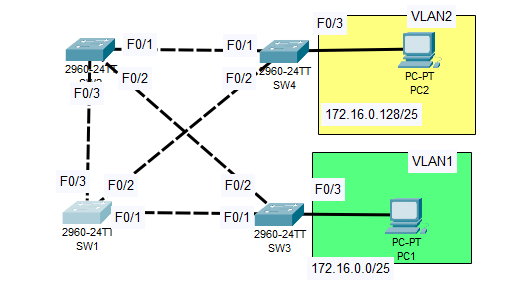

# Day 21 Lab - Configurating STP



## Use CLI to check STP Topology

1. We will check topology by using the CLI command ‘show spanning-tree vlan []’ to see which switch is the root bridge

```jsx
SW2>en
SW2#sh spanning-tree vlan 1
VLAN0001
  Spanning tree enabled protocol ieee
  Root ID    Priority    32769
             Address     0001.4301.4B81
             This bridge is the root
             Hello Time  2 sec  Max Age 20 sec  Forward Delay 15 sec

  Bridge ID  Priority    32769  (priority 32768 sys-id-ext 1)
             Address     0001.4301.4B81
             Hello Time  2 sec  Max Age 20 sec  Forward Delay 15 sec
             Aging Time  20

Interface        Role Sts Cost      Prio.Nbr Type
---------------- ---- --- --------- -------- --------------------------------
Fa0/2            Desg FWD 19        128.2    P2p
Fa0/1            Desg FWD 19        128.1    P2p
Fa0/3            Desg FWD 19        128.3    P2p

SW2#sh spanning
SW2#sh spanning-tree vlan 2
VLAN0002
  Spanning tree enabled protocol ieee
  Root ID    Priority    32770
             Address     0001.4301.4B81
             This bridge is the root
             Hello Time  2 sec  Max Age 20 sec  Forward Delay 15 sec

  Bridge ID  Priority    32770  (priority 32768 sys-id-ext 2)
             Address     0001.4301.4B81
             Hello Time  2 sec  Max Age 20 sec  Forward Delay 15 sec
             Aging Time  20

Interface        Role Sts Cost      Prio.Nbr Type
---------------- ---- --- --------- -------- --------------------------------
Fa0/2            Desg FWD 19        128.2    P2p
Fa0/1            Desg FWD 19        128.1    P2p
Fa0/3            Desg FWD 19        128.3    P2p
```

1. When checking all the switches, I can determine that SW2 is the Root Bridge

### STP role/state

1. SW2:
    1. F0/1 - 3: Designated, Forwarding States
2. SW1:
    1. F0/1: Non-designated, Blocking State
    2. F0/2: Designated, Forwarding State
    3. F0/3: Root port, Forwarding State
3. SW3:
    1. F0/1: Designated, Forwarding
    2. F0/2: Root port, Forwarding
    3. F0/3: Designated, Forwarding
4. SW4:
    1. 

All role/state are the same per VLAN

## Configure SW1

### SW1 as Primary Root for VLAN1 and Secondary for VLAN2

```jsx
SW1(config)#spanning-tree vlan 1 root primary
SW1(config)#spanning
SW1(config)#spanning-tree vlan 2 root secondary
```

### SW2 as Primary Root for VLAN2 and Secondary for VLAN1

```jsx
SW2(config)#spanning-tree vlan 2 root primary 
SW2(config)#span vlan 1 root secon
```

### SW1 and SW2 Updated role/state

SW1:

```jsx
SW1#show spanning-tree 
VLAN0001
  Spanning tree enabled protocol ieee
  Root ID    Priority    24577
             Address     0060.2F90.D14A
             This bridge is the root
             Hello Time  2 sec  Max Age 20 sec  Forward Delay 15 sec

  Bridge ID  Priority    24577  (priority 24576 sys-id-ext 1)
             Address     0060.2F90.D14A
             Hello Time  2 sec  Max Age 20 sec  Forward Delay 15 sec
             Aging Time  20

Interface        Role Sts Cost      Prio.Nbr Type
---------------- ---- --- --------- -------- --------------------------------
Fa0/1            Desg FWD 19        128.1    P2p
Fa0/2            Desg FWD 19        128.2    P2p
Fa0/3            Desg FWD 19        128.3    P2p

VLAN0002
  Spanning tree enabled protocol ieee
  Root ID    Priority    24578
             Address     0001.4301.4B81
             Cost        19
             Port        3(FastEthernet0/3)
             Hello Time  2 sec  Max Age 20 sec  Forward Delay 15 sec

  Bridge ID  Priority    28674  (priority 28672 sys-id-ext 2)
             Address     0060.2F90.D14A
             Hello Time  2 sec  Max Age 20 sec  Forward Delay 15 sec
             Aging Time  20

Interface        Role Sts Cost      Prio.Nbr Type
---------------- ---- --- --------- -------- --------------------------------
Fa0/1            Desg FWD 19        128.1    P2p
Fa0/2            Desg FWD 19        128.2    P2p
Fa0/3            Root FWD 19        128.3    P2p

```

SW2:

```jsx
SW2#show spanning-tree 
VLAN0001
  Spanning tree enabled protocol ieee
  Root ID    Priority    24577
             Address     0060.2F90.D14A
             Cost        19
             Port        3(FastEthernet0/3)
             Hello Time  2 sec  Max Age 20 sec  Forward Delay 15 sec

  Bridge ID  Priority    28673  (priority 28672 sys-id-ext 1)
             Address     0001.4301.4B81
             Hello Time  2 sec  Max Age 20 sec  Forward Delay 15 sec
             Aging Time  20

Interface        Role Sts Cost      Prio.Nbr Type
---------------- ---- --- --------- -------- --------------------------------
Fa0/2            Desg FWD 19        128.2    P2p
Fa0/1            Desg FWD 19        128.1    P2p
Fa0/3            Root FWD 19        128.3    P2p

VLAN0002
  Spanning tree enabled protocol ieee
  Root ID    Priority    24578
             Address     0001.4301.4B81
             This bridge is the root
             Hello Time  2 sec  Max Age 20 sec  Forward Delay 15 sec

  Bridge ID  Priority    24578  (priority 24576 sys-id-ext 2)
             Address     0001.4301.4B81
             Hello Time  2 sec  Max Age 20 sec  Forward Delay 15 sec
             Aging Time  20

Interface        Role Sts Cost      Prio.Nbr Type
---------------- ---- --- --------- -------- --------------------------------
Fa0/2            Desg FWD 19        128.2    P2p
Fa0/1            Desg FWD 19        128.1    P2p
Fa0/3            Desg FWD 19        128.3    P2p

```

### What changed?

Because SW1 is the Root Bridge for VLAN1, the command ‘show spanning-tree vlan 10’ shows “This bridge is the root,” turning all ports into designated/forwarding ports. Since it’s secondary root, the priority has increased and it no longer has a non-designated port. Has 2 designated ports and a root port in the interface connected to SW2.

For SW2, VLAN2 will still be the primary root so all ports are still designated. In VLAN’s 1 case, it puts a little more respect to SW1. The interface connected to SW1 is now a root port, while the others are designated ports.

### Increase VLAN1 Cost of SW4’s F0/2 Interface

1. Enter the f0/2 interface of SW4
2. Increase cost on VLAN1 by 100

```jsx
SW4(config-if)#spanning-tree vlan 1 cost 100
SW4(config-if)#do show spanning-tree
VLAN0001
  Spanning tree enabled protocol ieee
  Root ID    Priority    24577
             Address     0060.2F90.D14A
             Cost        38
             Port        1(FastEthernet0/1)
             Hello Time  2 sec  Max Age 20 sec  Forward Delay 15 sec

  Bridge ID  Priority    32769  (priority 32768 sys-id-ext 1)
             Address     0090.0C03.2D70
             Hello Time  2 sec  Max Age 20 sec  Forward Delay 15 sec
             Aging Time  20

Interface        Role Sts Cost      Prio.Nbr Type
---------------- ---- --- --------- -------- --------------------------------
Fa0/2            Altn BLK 100       128.2    P2p
Fa0/1            Root LRN 19        128.1    P2p

VLAN0002
  Spanning tree enabled protocol ieee
  Root ID    Priority    24578
             Address     0001.4301.4B81
             Cost        19
             Port        1(FastEthernet0/1)
             Hello Time  2 sec  Max Age 20 sec  Forward Delay 15 sec

  Bridge ID  Priority    32770  (priority 32768 sys-id-ext 2)
             Address     0090.0C03.2D70
             Hello Time  2 sec  Max Age 20 sec  Forward Delay 15 sec
             Aging Time  20

Interface        Role Sts Cost      Prio.Nbr Type
---------------- ---- --- --------- -------- --------------------------------
Fa0/2            Altn BLK 19        128.2    P2p
Fa0/1            Root FWD 19        128.1    P2p
Fa0/3            Desg FWD 19        128.3    P2p

```

### Increase VLAN1 Cost of SW1’s F0/1 Interface

```jsx
Enter configuration commands, one per line.  End with CNTL/Z.
SW1(config)#int f0/1
SW1(config-if)#span
SW1(config-if)#spanning-tree vlan 1 port
SW1(config-if)#spanning-tree vlan 1 port-priority 240
SW1(config-if)#do sh spanning-tree
VLAN0001
  Spanning tree enabled protocol ieee
  Root ID    Priority    24577
             Address     0060.2F90.D14A
             This bridge is the root
             Hello Time  2 sec  Max Age 20 sec  Forward Delay 15 sec

  Bridge ID  Priority    24577  (priority 24576 sys-id-ext 1)
             Address     0060.2F90.D14A
             Hello Time  2 sec  Max Age 20 sec  Forward Delay 15 sec
             Aging Time  20

Interface        Role Sts Cost      Prio.Nbr Type
---------------- ---- --- --------- -------- --------------------------------
Fa0/1            Desg LIS 19        240.1    P2p
Fa0/2            Desg FWD 19        128.2    P2p
Fa0/3            Desg FWD 19        128.3    P2p

VLAN0002
  Spanning tree enabled protocol ieee
  Root ID    Priority    24578
             Address     0001.4301.4B81
             Cost        19
             Port        3(FastEthernet0/3)
             Hello Time  2 sec  Max Age 20 sec  Forward Delay 15 sec

  Bridge ID  Priority    28674  (priority 28672 sys-id-ext 2)
             Address     0060.2F90.D14A
             Hello Time  2 sec  Max Age 20 sec  Forward Delay 15 sec
             Aging Time  20

Interface        Role Sts Cost      Prio.Nbr Type
---------------- ---- --- --------- -------- --------------------------------
Fa0/1            Desg FWD 19        128.1    P2p
Fa0/2            Desg FWD 19        128.2    P2p
Fa0/3            Root FWD 19        128.3    P2p

```

### Does SW3 select a different root port?  Why/why not?

SW3 doesn’t change the root port. The reason for this is because the priority change is in VLAN1, not VLAN2. VLAN2 is the one that has a root port. Plus, SW2 has a lower priority and MAC address, so changing the priority number makes no difference since that’s the last step if the Bridge ID is the same between both switches. In this case, SW2 has a higher priority for VLAN1

## Configure PortFast and BPDU Guard on F0/3 of SW3/4

SW3:

```jsx
SW3(config)#int f0/3
SW3(config-if)#span
SW3(config-if)#spanning-tree portfast
%Warning: portfast should only be enabled on ports connected to a single
host. Connecting hubs, concentrators, switches, bridges, etc... to this
interface  when portfast is enabled, can cause temporary bridging loops.
Use with CAUTION

%Portfast has been configured on FastEthernet0/3 but will only
have effect when the interface is in a non-trunking mode.
SW3(config-if)#spanning-tree bpduguard enable
SW3(config-if)#do sh span int f0/3 detail

Port 3 (FastEthernet0/3) of VLAN0001 is designated forwarding
  Port path cost 19, Port priority 128, Port Identifier 128.3
  Designated root has priority 24577, address 0060.2F90.D14A
  Designated bridge has priority 32769, address 0040.0B50.AA56
  Designated port id is 128.3, designated path cost 19
  Timers: message age 16, forward delay 0, hold 0
  Number of transitions to forwarding state: 1
  The port is in the portfast mode
  Link type is point-to-point by default
```

SW4:

```jsx
SW4(config)#spanning
SW4(config)#spanning-tree portfast bpduguard default
SW4(config)#do sh spanning-tree int f0/3 detail

Port 3 (FastEthernet0/3) of VLAN0002 is designated forwarding
  Port path cost 19, Port priority 128, Port Identifier 128.3
  Designated root has priority 24578, address 0001.4301.4B81
  Designated bridge has priority 32770, address 0090.0C03.2D70
  Designated port id is 128.3, designated path cost 19
  Timers: message age 16, forward delay 0, hold 0
  Number of transitions to forwarding state: 1
  The port is in the portfast mode by default
  Link type is point-to-point by default
```

## What does PortFast do?

PortFast is used to make sure the end host is able to connect without delays. A quick experiment to see if this works is to disconnect the wire connected to the end host and the switch and see if the interface goes green instantly after connecting 


When I connected the switch to the PC there were no delays :)

### What does BPDU Guard do?

BPDU Guard makes sure that no higher-priority BPDU is sent to the switch. This is used to make sure that no end-host users can connect a switch to the current switch and change the whole topology. When this happens, the port goes into an err-disable state and becomes disabled until the problem is fixed. To test this out I will redirect f0/3 interface for SW3 and connect it to SW4. This should disable the interface.


SW3:

```jsx
%LINEPROTO-5-UPDOWN: Line protocol on Interface FastEthernet0/3, changed state to up
%SPANTREE-2-BLOCK_BPDUGUARD: Received BPDU on port FastEthernet0/3 with BPDU Guard enabled. Disabling port.

%PM-4-ERR_DISABLE: bpduguard error detected on 0/3, putting 0/3 in err-disable state

```

As you can see, the interface goes in a err-disable state. I will now reconnect it to the PC.


When I do this, it is still disabled. I will reverse this by shutting down the interface and turning it back on.

```jsx
SW3>en
SW3#conf t
Enter configuration commands, one per line.  End with CNTL/Z.
SW3(config)#int f0/3
SW3(config-if)#shutdown

%LINK-5-CHANGED: Interface FastEthernet0/3, changed state to administratively down
SW3(config-if)#no shutdown

SW3(config-if)#
%LINK-5-CHANGED: Interface FastEthernet0/3, changed state to up

%LINEPROTO-5-UPDOWN: Line protocol on Interface FastEthernet0/3, changed state to up
```


It is now up and running :D